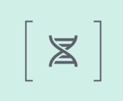
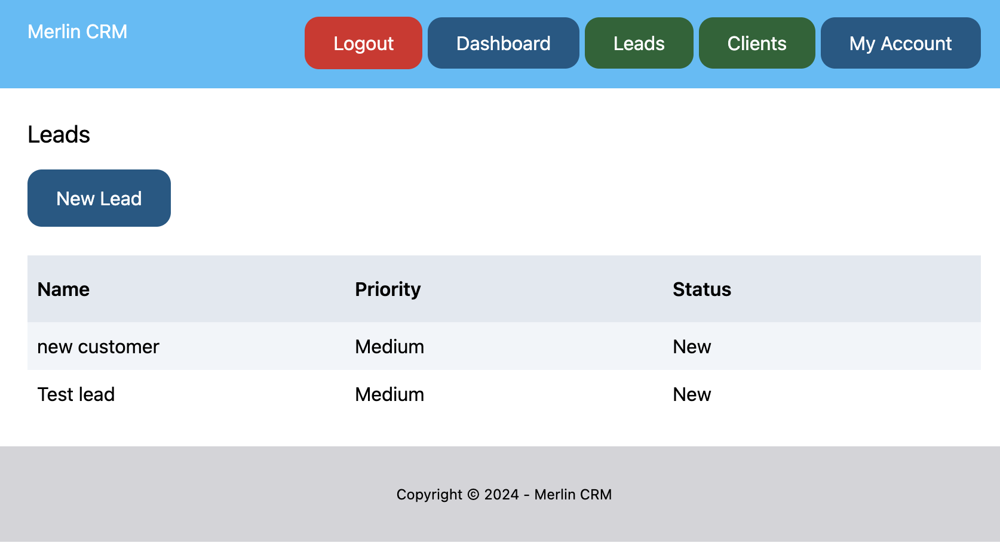

# 

# Merlin CRM
## Overview:
### Merlin CRM is a simple Customer Relationship Management (CRM) application built using Django. The application provides basic functionalities for managing leads &  clients. It is designed to help businesses keep track of their interactions with potential and existing clients.

#### [Here is the live version of my project](https://battleship-cbstange-ca945b7bee2a.herokuapp.com/).

## Planning:
- Researched popular [CRM applications](https://www.capterra.com/sem-compare/customer-relationship-management-software/?utm_source=ps-google&utm_medium=ppc&utm_campaign=:1:CAP:2:COM:3:All:4:INTL:5:BAU:6:SOF:7:Desktop:8:BR:9:CRM&network=g&gclid=Cj0KCQiA5-uuBhDzARIsAAa21T-gpUE1UGMnOwNaDPJqb2YoZORlvPsBz5HFY4qjbU2wVk9nCy1MzmoaApqBEALw_wcB) for inspiration and explaination of general priciples behind a CRM.
- Created [wireframes](.//assets/images/readme-wireframe.png) to guide basic structure and styling.

## Frameworks & Libraries:
- Django Python framework was used for development and handled:
    - User authentication
    - Messages

## Current Features:
## Home
- 
    - When a user is not logged in, only "Sign Up" and "Login" are displayed.

## Sign Up
- 
    - Built-in Django credential validation used to verify valid data entered.

## Login
- 
    - Once logged in, user is directed to their dashboard view.

## Dashboard
- 
    - A list of the 5 most recent clients is displayed.
    - Each client has a "details" button to display more information.

## Lead/client list
- 
    - Leads and clients are displayed as a list. Clicking on the name of the lead/client directs user to more details.

## Client/lead details
- 
    - Name, description, email, created-on, modified-on fields are displayed.
    - User has the option to edit, delete or return to the list.

## Conversion
- Once a lead is qualified, user can convert the lead to a client.

## My Account
- 
    - User can view username and email associated with their account.

        

## Future Features:
- Option to update login credentials.
- Add search functionality to query lead/client database.
- Add more comprehensive CSS styling to provide a more attractive aesthetic.

## Testing:
- Regular print() statements were used to verify expected behavior.
- DEBUG mode used inside Django to monitor and identify bugs when making changes and navigating site.
- 

- ### Validation:
    - Python code validity check with [Code Institues's Tool](https://pep8ci.herokuapp.com/#).
    - Used [Black]([https://codebeautify.org/python-formatter-beautifier#](https://black.readthedocs.io/en/stable/)) to check for and correct indentation issues and maintain formatting guidelines.
- ### GitHub was used for version control.

## Diployment:
- [Heroku](https://www.heroku.com/) was used for app deployment
- [WhiteNoise](https://whitenoise.readthedocs.io/en/stable/django.html) hosted the static files.

## Database:
- [ElephantSQL](https://www.elephantsql.com/) for PostgreSQL database hosting.

## Resolved Bugs:
- CSS styles were not applied after deployment to Heroku.
    - Caused because the static files were not being hosted. Resolved by using [WhiteNoise](https://whitenoise.readthedocs.io/en/stable/index.html) to host static files.
- FILLER TEXTTTTTT

## Credits:
### Media:
- Images were sourced from [Unsplash](https://unsplash.com/) which is a site that provides free images so there are no copywrite violations.
- [Mockup](https://websitemockupgenerator.com/) image generator was used to create image for readme file.
- Wireframe created using [Lucid Chart](https://lucidchart.com/).
    - Wireframe can be found here.

### Styling:
-[Tailwind](https://tailwindcss.com/) CSS framework was used for styling.

### Supporting documents:
- YoutTube channel [Code With Stein](https://www.youtube.com/watch?v=LWro0nVdrBw&list=PLpyspNLjzwBka94O3ABYcRYk8IaBR8hXZ&index=1) was used to guide basic structure of the application.
-  [Official Django documentation](https://docs.djangoproject.com/en/5.0/) 
